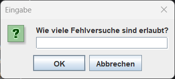
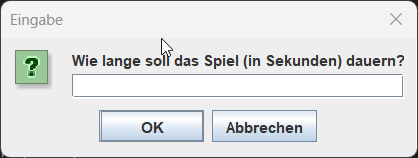

# Hanged Man Spiel - Java GUI Version

Dies ist eine Java-Implementierung des klassischen Hanged Man Spiels mit einer grafischen Benutzeroberfläche (GUI), die mit Swing erstellt wurde. Das Projekt verwendet verschiedene Bilder, Timer und sogar ein Easter Egg, um die Spielerfahrung unterhaltsamer zu gestalten.

## Funktionsbeschreibung

Das Spiel ist einfach aufgebaut: Der Benutzer muss ein Wort erraten, indem er Buchstaben nacheinander eingibt. Der Spieler hat eine begrenzte Anzahl von Fehlversuchen, bevor das Spiel endet. Zusätzlich wird ein Timer verwendet, um eine maximale Zeit für die Eingabe festzulegen.

### Hauptmerkmale
- **Eingabe von Buchstaben oder Wörtern**: Der Benutzer kann entweder einen einzelnen Buchstaben oder das gesamte Wort eingeben, um das Rätsel zu lösen.
- **Bilder**: Bei jedem Fehlversuch wird ein neues Bild angezeigt, das den Fortschritt des gehängten Mannes darstellt. Bei 9 Fehlversuchen endet das Spiel mit einem "Game Over".
- **Timer**: Ein Timer läuft ab, um die Eingabezeit zu begrenzen. Wenn der Timer abgelaufen ist, werden nacheinander Timer-spezifische Bilder angezeigt, bevor das Spiel endet.
- **Easter Egg**: Wenn der Benutzer das Wort "fallen" eingibt, wird ein Easter Egg aktiviert, bei dem spezielle Bilder angezeigt werden und der Spieler automatisch gewinnt.

## Spielablauf
1. Zu Beginn des Spiels wählt der Benutzer die maximale Anzahl der Fehlversuche sowie die verfügbare Zeit in Sekunden aus.
2. Der Benutzer gibt Buchstaben oder das gesamte Wort über ein Textfeld ein.
3. Bei einer korrekten Eingabe wird der Fortschritt des zu erratenden Wortes aktualisiert. Bei einer falschen Eingabe erhöht sich die Anzahl der Fehlversuche und ein neues Bild wird angezeigt.
4. Das Spiel endet, wenn entweder das Wort erraten wurde, die Fehlversuche aufgebraucht sind oder der Timer abgelaufen ist.
5. Im Falle des Easter Eggs werden spezielle Bilder angezeigt und der Spieler gewinnt automatisch.

## Voraussetzungen
- **Java Development Kit (JDK)**: Version 8 oder höher.
- **IDE**: Empfohlen wird IntelliJ IDEA oder eine ähnliche Entwicklungsumgebung, die GUI-Formulare (.form-Dateien) unterstützt.

## Installation & Ausführen
1. Klone dieses Repository auf deinen lokalen Rechner.
2. Öffne das Projekt in deiner bevorzugten IDE.
3. Stelle sicher, dass alle benötigten Bilder (HangedMan1.png bis HangedMan9.png, HangedManTimer1.png bis HangedManTimer3.png, HangedManEasterEGG1.png, HangedManEasterEGG2.png, und EndTheme.jpg) im Verzeichnis `images` vorhanden sind.
4. Führe die `HangedMan.java`-Datei aus, um das Spiel zu starten.

## Steuerung
- **Textfeld**: Geben Sie einzelne Buchstaben ein, um das Wort zu erraten, oder das Wort "fallen", um das Easter Egg zu aktivieren.
- **Timer**: Die verbleibende Zeit wird auf der Benutzeroberfläche angezeigt. Sobald die Zeit abgelaufen ist, werden automatisch Timer-Bilder angezeigt.

## Besonderheiten
- **Easter Egg**: Bei Eingabe des Wortes "fallen" werden die Bilder `HangedManEasterEGG1.png` und `HangedManEasterEGG2.png` angezeigt, und der Spieler gewinnt automatisch.
- **Verlauf und Statistik**: Die Anzahl der gewonnenen und verlorenen Spiele wird während der gesamten Spielsession verfolgt.

## Screenshots
Hier sind einige Screenshots des Spiels, die das Hauptfenster und das Gameplay zeigen:

### Hauptfenster (MainWindow)

### JavaFrage1

### JavaFrage2

## Lizenz
Dieses Projekt steht unter der MIT-Lizenz. Weitere Informationen findest du in der Datei `LICENSE`.

[JavaFrage1]: JavaFrage1.png
[JavaFrage2]: JavaFrage2.png
[MainWindow]: MainWindow.png
